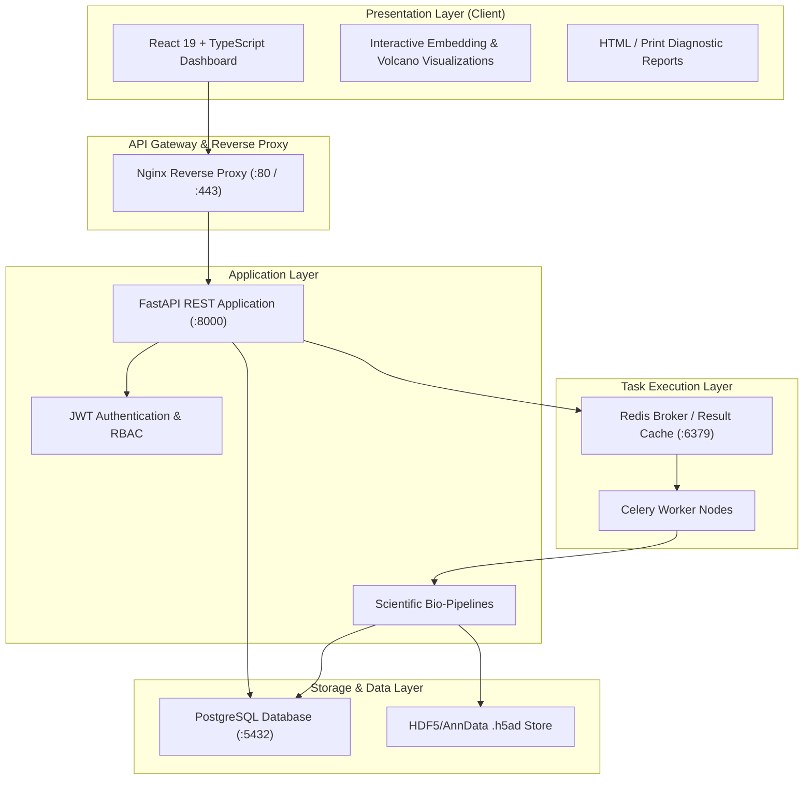

# CellMap BioAnalytics 🧬

### Hybrid Topology-Preserving PCA + UMAP Visualization Pipeline for Single-Cell Biomarker Discovery

[](LICENSE)
[](https://python.org)
[](https://fastapi.tiangolo.com)
[](https://react.dev)
[](https://docker.com)

---

## 1. Executive Summary & Overview

**CellMap BioAnalytics** is a production-ready computational biology and bioinformatics platform engineered for high-throughput **single-cell RNA sequencing (scRNA-seq)** data exploration and **precision biomarker discovery**.

Standard single-cell pipelines frequently confront a critical dilemma in dimensionality reduction:
- **Principal Component Analysis (PCA)** faithfully preserves global geometric distances and orthogonal variance, but fails to capture complex non-linear manifolds, manifold branching, and discrete cluster separations.
- **Direct Uniform Manifold Approximation and Projection (UMAP)** produces visually separated clusters, but distorts global geometry, suffers from severe noise sensitivity when run on raw high-dimensional gene counts, and risks misrepresenting topological relationships between distant cell types.

**CellMap BioAnalytics solves this via a mathematically sound Hybrid PCA → Topology-Preserving UMAP Architecture:**
1. High-dimensional expression matrices are standardized and compressed onto an orthogonal subspace spanned by top informative principal components ($K=30\dots50$).
2. A high-dimensional k-nearest-neighbor (k-NN) fuzzy simplicial set graph is constructed on the spectral manifold.
3. A low-dimensional embedding is optimized under multi-scale neighborhood constraints, continuously benchmarked with quantitative **Trustworthiness**, **Continuity**, and **k-NN Conservation** metrics.
4. Integrated **Leiden community detection**, **Wilcoxon rank-sum differential expression**, and **multi-criteria ROC-AUC biomarker scoring** systematically rank diagnostic candidate genes with full provenance tracking.

---

## 2. Key Features

- **End-to-End Analysis Workflow**:
  - Quality control filtering (UMI counts, detected gene count, mitochondrial/ribosomal transcript thresholds).
  - Size-factor normalization, $\log_1p$ variance stabilization, and highly variable gene (HVG) selection.
  - Multi-solver Principal Component Analysis with explained variance ratios and gene loading decompositions.
  - Hybrid Topology-Preserving PCA+UMAP engine with side-by-side metric benchmarks (Trustworthiness, Continuity, k-NN preservation).
  - Graph-based Leiden community detection with resolution tuning.
  - High-performance Differential Expression (Wilcoxon rank-sum & t-test) with Benjamini-Hochberg False Discovery Rate (FDR) correction.
  - Composite Biomarker Discovery engine scoring candidates across effect size, statistical significance, target cluster specificity, and classification ROC-AUC.
  - Batch effect diagnostics calculating Shannon mixing entropy across cellular neighborhoods.
- **Enterprise-Grade Architecture**:
  - Asynchronous REST API powered by **FastAPI** with JWT role-based authentication.
  - Distributed job queue backed by **Celery** and **Redis**.
  - PostgreSQL schema modeling users, datasets, experiments, analysis jobs, biomarkers, and immutable audit logs.
  - Automated JSON results and SHA-256 reproducibility manifests for every step.
  - Executive-ready HTML bioinformatics report generator.
- **Interactive Web Dashboard**:
  - Built with **React 19, TypeScript, and Vite**.
  - Glassmorphic dark/light scientific user interface.
  - Multi-panel side-by-side embedding explorer (PCA vs Direct UMAP vs Hybrid UMAP).
  - Volcano plots, expression heatmaps, QC violin plots, and biomarker ROC curves.
  - Real-time job status timelines and gene lookup explorer.

---

## 3. Architecture Overview



---

## 4. Scientific Foundations & Mathematical Methodology

### 4.1 Hybrid Topology-Preserving Dimensionality Reduction
Given a normalized expression matrix $\mathbf{X} \in \mathbb{R}^{N \times G}$ for $N$ cells and $G$ highly variable genes:
1. **Spectral Compression**: Compute singular value decomposition $\mathbf{X} = \mathbf{U} \mathbf{\Sigma} \mathbf{V}^T$, projecting cells onto top $K$ principal components $\mathbf{Z} = \mathbf{U}_K \mathbf{\Sigma}_K \in \mathbb{R}^{N \times K}$. This filters non-biological Poisson shot noise while retaining $>80\%$ of biological variance.
2. **Metric Graph Construction**: On manifold $\mathbf{Z}$, construct a directed k-nearest-neighbor graph under cosine or Euclidean distance. The affinity between cell $i$ and neighbor $j$ is modeled as:
   $$p_{j|i} = \exp\left(-\frac{\max(0, d(\mathbf{z}_i, \mathbf{z}_j) - \rho_i)}{\sigma_i}\right)$$
   where $\rho_i$ is distance to the nearest neighbor, and $\sigma_i$ satisfies $\sum_j p_{j|i} = \log_2(k)$.
3. **Fuzzy Simplicial Union**: Symmetric high-dimensional probabilities are formed:
   $$p_{ij} = p_{i|j} + p_{j|i} - p_{i|j}p_{j|i}$$
4. **Low-Dimensional Layout Optimization**: In 2D embedding space $\mathbf{Y} \in \mathbb{R}^{N \times 2}$, low-dimensional affinities $q_{ij} = (1 + a \|\mathbf{y}_i - \mathbf{y}_j\|^{2b})^{-1}$ are optimized by minimizing fuzzy cross-entropy:
   $$C(\mathbf{P}, \mathbf{Q}) = \sum_{i \neq j} \left( p_{ij} \log \frac{p_{ij}}{q_{ij}} + (1 - p_{ij}) \log \frac{1 - p_{ij}}{1 - q_{ij}} \right)$$

### 4.2 Quantitative Topology Preservation Metrics
- **k-NN Neighborhood Preservation**:
  $$\text{Preservation}(k) = \frac{1}{N} \sum_{i=1}^N \frac{| \mathcal{N}_k^{\text{high}}(i) \cap \mathcal{N}_k^{\text{low}}(i) |}{k}$$
- **Trustworthiness**: Quantifies false positive neighbors in embedding:
  $$T(k) = 1 - \frac{2}{N k (2N - 3k - 1)} \sum_{i=1}^N \sum_{j \in \mathcal{U}_i^k} (r(i, j) - k)$$
  where $r(i, j)$ is the rank of cell $j$ in high-dimensional space, and $\mathcal{U}_i^k$ are points in low-dimensional $k$-neighborhood but not in high-dimensional $k$-neighborhood.
- **Continuity**: Quantifies false negative neighbors missed in low-dimensional projection.

### 4.3 Composite Biomarker Prioritization Score
For gene $g$ in cluster $c$:
$$\text{Score}(g, c) = w_1 \cdot \text{AUC}_g + w_2 \cdot \widetilde{\text{FC}}_g + w_3 \cdot (1 - \widetilde{p}_g) + w_4 \cdot \text{Spec}_g + w_5 \cdot \text{Prev}_g$$
- $\text{AUC}_g$: Area under the receiver operating characteristic curve discriminating cluster $c$ against all other cells.
- $\widetilde{\text{FC}}_g$: Sigmoid-scaled $\log_2 \text{Fold Change}$.
- $\widetilde{p}_g$: FDR-adjusted p-value significance score ($-\log_{10}(p_{\text{adj}})$ normalized).
- $\text{Spec}_g$: Cluster specificity index $\frac{\text{MeanExp}_{c, g}}{\sum_{k} \text{MeanExp}_{k, g}}$.
- $\text{Prev}_g$: Detection frequency in cluster $c$.

---

## 5. Directory Structure

```text
cellmap-bioanalytics/
├── .env.example
├── docker-compose.yml
├── README.md
├── LICENSE
├── backend/
│   ├── requirements.txt
│   ├── app/
│   │   ├── main.py
│   │   ├── core/
│   │   │   ├── config.py
│   │   │   ├── database.py
│   │   │   └── security.py
│   │   ├── models/
│   │   │   ├── user.py
│   │   │   ├── dataset.py
│   │   │   ├── experiment.py
│   │   │   ├── job.py
│   │   │   ├── biomarker.py
│   │   │   └── audit.py
│   │   ├── schemas/
│   │   │   ├── auth.py
│   │   │   ├── dataset.py
│   │   │   └── experiment.py
│   │   ├── pipelines/
│   │   │   ├── qc/
│   │   │   ├── preprocessing/
│   │   │   ├── dimensionality_reduction/
│   │   │   ├── clustering/
│   │   │   ├── differential_expression/
│   │   │   ├── biomarkers/
│   │   │   └── batch/
│   │   ├── services/
│   │   │   ├── dataset_service.py
│   │   │   └── report_service.py
│   │   ├── api/
│   │   │   ├── auth.py
│   │   │   ├── datasets.py
│   │   │   ├── experiments.py
│   │   │   └── reports.py
│   │   └── workers/
│   │       ├── celery_app.py
│   │       └── tasks.py
│   └── tests/
│       ├── conftest.py
│       ├── test_pipelines/
│       └── test_api/
├── frontend/
│   ├── index.html
│   ├── package.json
│   ├── src/
│   │   ├── main.tsx
│   │   ├── App.tsx
│   │   ├── index.css
│   │   ├── components/
│   │   ├── pages/
│   │   ├── charts/
│   │   └── services/
├── docker/
│   ├── Dockerfile.backend
│   ├── Dockerfile.frontend
│   ├── nginx.conf
│   └── nginx-frontend.conf
└── scripts/
    ├── generate_demo_data.py
    └── init_db.py
```

---

## 6. Getting Started & Installation

### Option A: Docker Compose (Recommended)

1. Clone the repository and copy the environment template:
   ```bash
   cp .env.example .env
   ```
2. Build and launch all services:
   ```bash
   docker compose up --build -d
   ```
3. Initialize the database schema and admin user:
   ```bash
   docker compose exec backend python scripts/init_db.py
   ```
4. Access the web dashboard at `http://localhost:3000` and interactive API documentation at `http://localhost:8000/docs`.

### Option B: Local Development

#### Backend Setup
```bash
cd backend
python -m venv venv
source venv/bin/activate  # On Windows: venv\Scripts\activate
pip install -r requirements.txt
python ../scripts/init_db.py
uvicorn app.main:app --reload --port 8000
```

#### Frontend Setup
```bash
cd frontend
npm install
npm run dev
```

---

## 7. Running Celery Workers

To execute asynchronous pipeline jobs (QC, PCA, UMAP, Leiden clustering, Differential Expression, and Biomarker ranking):
```bash
cd backend
celery -A app.workers.celery_app worker --loglevel=info --concurrency=4
```

---

## 8. Generating Synthetic Demonstration Data

To test the entire pipeline without clinical data, generate the 5-population synthetic scRNA-seq benchmark dataset (T cells, B cells, Monocytes, NK cells, Dendritic cells):
```bash
python scripts/generate_demo_data.py --output data/demo_dataset.h5ad
```

---

## 9. Running Tests

Execute backend unit and integration test suites:
```bash
cd backend
pytest tests/ -v
```

---

## 10. API Specification Highlights

| Method | Endpoint | Description |
|---|---|---|
| `POST` | `/api/v1/auth/register` | Register a new platform user |
| `POST` | `/api/v1/auth/login` | Authenticate and obtain JWT bearer tokens |
| `GET` | `/api/v1/datasets` | List uploaded AnnData/expression datasets |
| `POST` | `/api/v1/datasets/upload` | Upload `.h5ad`, `.csv`, or `.tsv` matrix |
| `POST` | `/api/v1/experiments` | Initialize a new experiment with pipeline configs |
| `POST` | `/api/v1/experiments/{id}/run/{step}` | Dispatch Celery task (`qc`, `pca`, `umap`, `cluster`, `de`, `biomarkers`, `full`) |
| `GET` | `/api/v1/experiments/{id}/status` | Check real-time pipeline job status |
| `GET` | `/api/v1/experiments/{id}/results/{step}` | Retrieve computed coordinates and metrics |
| `GET` | `/api/v1/experiments/{id}/biomarkers` | Query ranked candidate biomarkers with filters |
| `GET` | `/api/v1/experiments/{id}/manifest` | Fetch SHA-256 reproducibility manifest |
| `GET` | `/api/v1/reports/{id}/html` | Generate executive publication-grade HTML report |

---

## 11. License

This project is licensed under the MIT License — see the [LICENSE](LICENSE) file for details.
